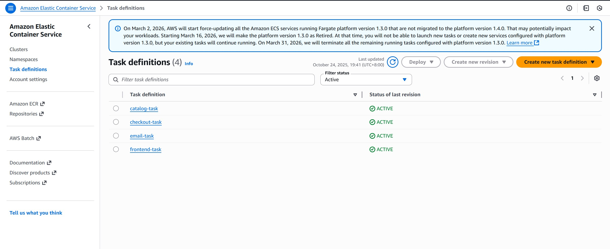
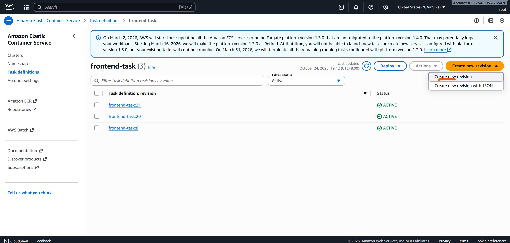
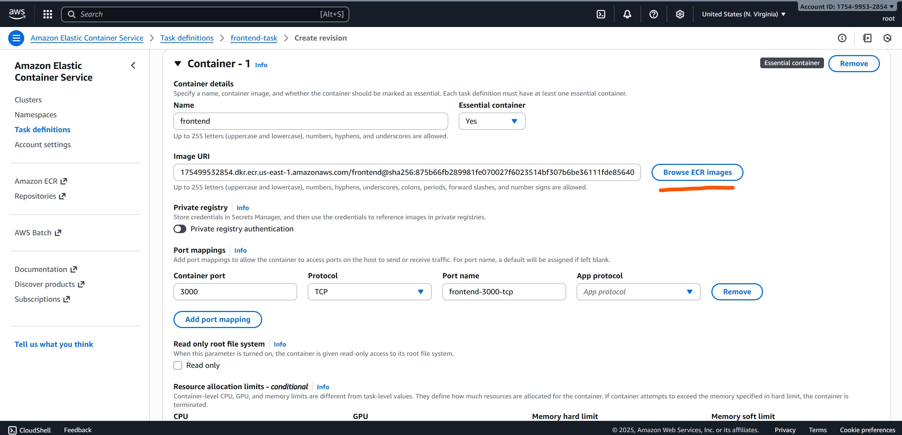
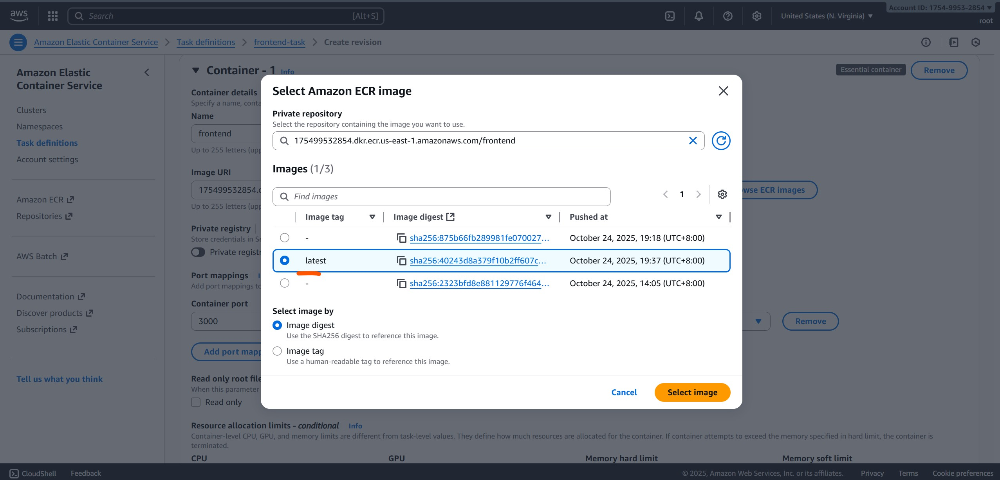
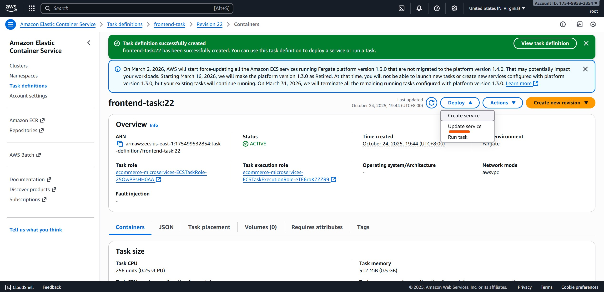
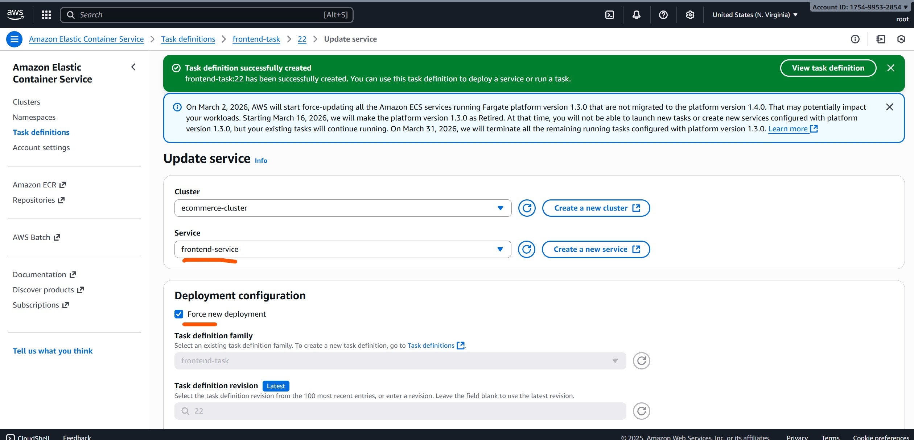
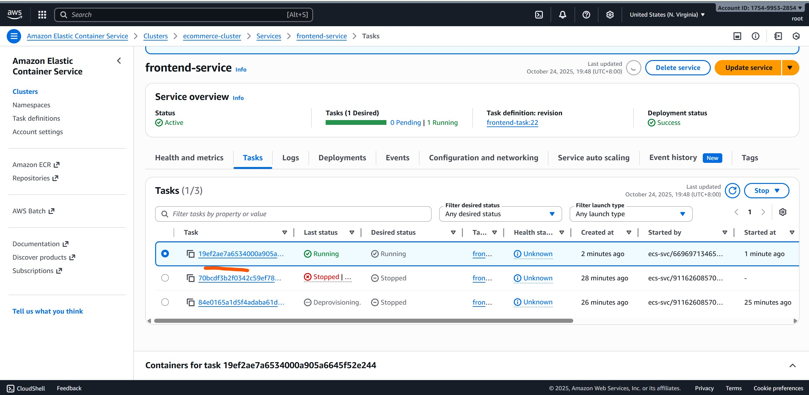
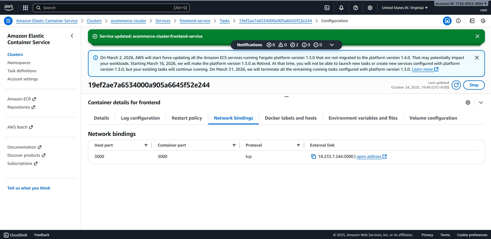

# FRONTEND Service Rebuild

This guide outlines the steps to deploy the rebuilt Docker images for the **frontend service** on AWS ECS.

---

## Steps to Rebuild Frontend Service

### 1️⃣ Go to Task Definitions

Navigate to **ECS → Task Definitions** to manage your service tasks.  

---

### 2️⃣ Create New Task Definition

Click **Create new Task Definition** to start a new deployment.  

---

### 3️⃣ Choose ECR Image

Select the **ECR repository** that contains your rebuilt frontend image.  

---

### 4️⃣ Pick the Latest Image

Choose the **latest image tag** to ensure you deploy the newest build.  

---

### 5️⃣ Create Task Definition

Click **Create** to finalize the new task definition.

After creation, you will be redirected to the **task definition page**.  

---

### 6️⃣ Deploy and Update Service

Click **Deploy** to update the frontend service.  

---

### 7️⃣ Choose Frontend Service and Force Deployment

Select the **frontend service** and check **Force New Deployment**.  

---

### 8️⃣ Wait for Service Rebuild

Wait until the ECS service finishes updating with the new task definition.

---

### 9️⃣ Get the Public IP Address

1. Go to the **Tasks tab** and click the running task.
2. In the **Task Details** tab, expand **Container Details** → **Network Bindings**.
3. The **public raw IP address** listed is the address your frontend app is using.  
   

---

### 📝 Note

These steps can also be used to rebuild **other services**.  
Simply replace the references to the **frontend service** with the relevant service name and ECR image.
