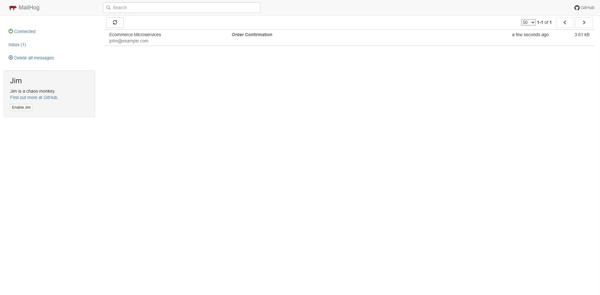

# Frontend Testing Guide

This guide explains how to test the frontend e-commerce application step by step.

---

## 1️⃣ Open the Frontend

Open the frontend URL in your browser. You should see the **homepage**.

Click the **Shop Now** button to view products. 

---

## 2️⃣ View Product Details

Select any product and click **View Details** to go to the product detail page. 

Click **Add to Cart** to add the product to your basket. 

---

## 3️⃣ Cart Notification

After adding a product, a notification will appear on the **cart icon** reflecting the total quantity of products.

Click the **Basket** button to go to the **cart page**. 

---

## 4️⃣ Checkout

On the cart page, click **Proceed to Checkout**. 

On the checkout page, fill in the **Email** field.

> **Note:** The application now uses **MailHog** for testing email delivery.

Click **Place Order** to complete the checkout. 

---

## 5️⃣ Order Confirmation

After placing the order, a **notification message** will confirm that the order was successful. 

---

## 6️⃣ View Email in MailHog

Once the order is placed, you can verify the email in MailHog.

1. Open your browser and go to [http://localhost:8025](http://localhost:8025)
   *(or use your server’s IP, e.g. `http://<PRIVATE_IP>:8025` if running remotely).*

2. The MailHog dashboard will show a list of captured emails.

3. Click the latest message to view its contents — this simulates how the customer would receive the confirmation email.

 