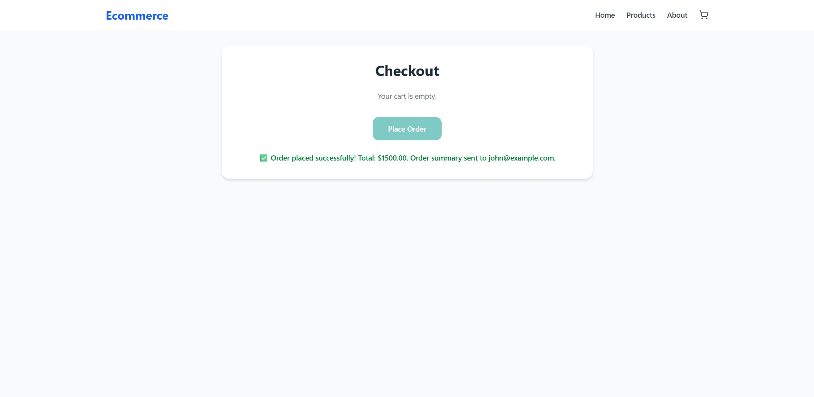

# Frontend Testing Guide

This guide explains how to test the frontend e-commerce application step by step.

---

## 1️⃣ Open the Frontend

Open the frontend URL in your browser. You should see the **homepage**.

Click the **Shop Now** button to view products.

---

## 2️⃣ View Product Details

Select any product and click **View Details** to go to the product detail page.

Click **Add to Cart** to add the product to your basket.

---

## 3️⃣ Cart Notification

After adding a product, a notification will appear on the **cart icon** reflecting the total quantity of products.

Click the **Basket** button to go to the **cart page**.

## 4️⃣ Checkout

On the cart page, click **Proceed to Checkout**.

On the checkout page, fill in the **Email** field.

> **Note:** Currently, the application uses **Mailtrap sandbox**, so the email will be sent to the sandbox inbox.

Click **Place Order** to complete the checkout.

## 5️⃣ Order Confirmation

After placing the order, a **notification message** will confirm that the order was successful.

